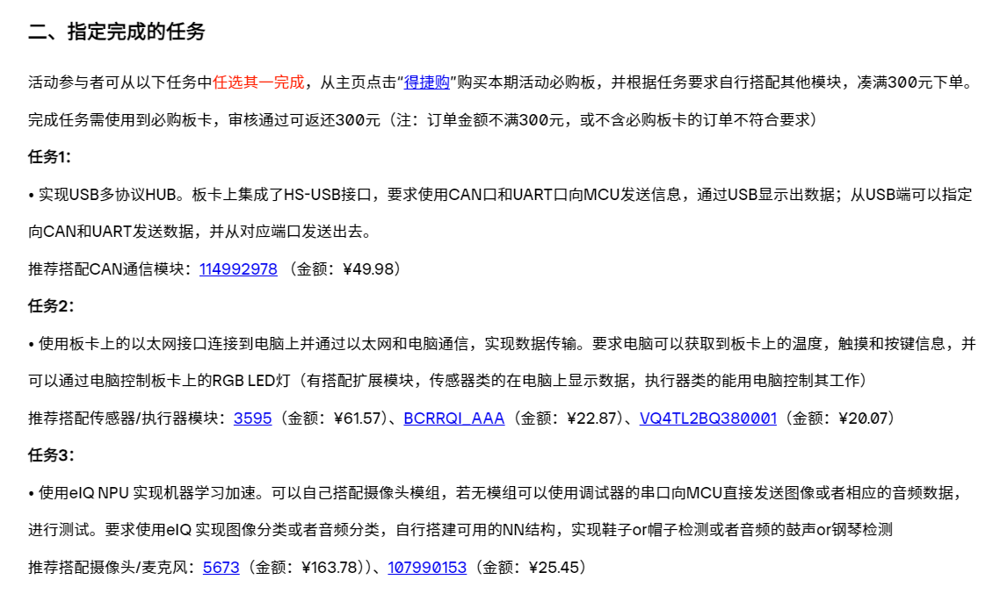

# mcxn947 实践

## 任务要求



## 开箱

从 rtt github 仓库拉取的 bsp 例程有问题，需要使用 scons --target=mdk5 重新生成下

使用 scons 命令创建独立的项目目录

```
scons --dist --target=mdk --project-name=rtt_n947 --project-path=d:/1my_program_study/funpack3-4/rtt_n947
```

命令行结果

````
scons: Reading SConscript files ...
Keil5 project is generating...                                                                                                              ```
Keil Version: 0.0
Keil-MDK project has generated successfully!
make distribution....
=> frdm-mcxn947
=> start dist handle
=> copy bsp drivers
=> copy bsp CMSIS
=> copy bsp library
=> components
=> include
=> libcpu
=> src
=> tools
Update configuration files...
b'scons: Reading SConscript files ...\r\nKeil5 project is generating...\r\nKeil Version: 0.0\r\nKeil-MDK project has generated successfully!
\r\n'
dist project successfully!
````

打开 eth,只要在 chip driver 中使能，并在 rtconfig.h 中修改 RT_LWIP_TCPTHREAD_STACKSIZE 大小为 2048 即可。

rtt 的 tcp 客户端示例需要添加头文件`#include <stdlib.h>`才不会报错

## 引脚分配

| CAM 引脚 | CAM 功能  | eth 引脚 | eth 功能   |
| -------- | --------- | -------- | ---------- |
| P1_4     | CAM_D0    | P1_4     | ENET_TXCLK |
| P1_5     | CAM_D1    | P1_5     | ENET_TXEN  |
| P1_6     | CAM_D2    | P1_6     | ENET_TXD0  |
| P1_7     | CAM_D3    | P1_7     | ENET_TXD1  |
| P3_4     | CAM_D4    | P1_13    | ENET_RXDV  |
| P3_5     | CAM_D5    | P1_14    | ENET_RXD0  |
| P1_10    | CAM_D6    | P1_15    | ENET_RXD1  |
| P1_11    | CAM_D7    | P1_21    | ENET_MDIO  |
| P1_18    | CAM_PDW   | P1_20    | ENET_MDC   |
| P1_19    | CAM_RST   | P5_8     | ENET_RST   |
| P0_5     | CAM_PCLK  |          |            |
| P2_2     | CAM_CLKIN |          |            |
| P0_11    | CAM_HS    |          |            |
| P0_4     | CAM_VS    |          |            |
| P3_3     | CAM_SCL   |          |            |
| P3_2     | CAM_SDA   |          |            |

| 其他引脚 | 功能       | Mikro Bus 引脚 | 功能     |
| -------- | ---------- | -------------- | -------- |
| P0_10    | LED_RED    | AN             | ADC1_A0  |
| P0_27    | LED_GREEN  | P1_3           | RESET    |
| P1_2     | LED_BLUE   | P3_23          | SPI_CS   |
| P0_23    | WK_UP 按键 | P3_21          | SPI_CLK  |
| P1_3     | TOUCH_PAD  | P3_22          | SPI_MISO |
| P1_10    | CAN_TX     | P3_20          | SPI_MOSI |
| P1_11    | CAN_RX     | P3_19          | PWM      |
| P1_16    | I3C_SCL    | P5_7           | INT      |
| P1_17    | I3C_SDA    | P1_16          | RX       |
| P1_11    | I3C_PUR    | P1_17          | TX       |
|          |            | P1_1           | I2C_SCL  |
|          |            | P1_0           | I2C_SDA  |

| PMOD 引脚 | 功能    | PMOD 引脚 | 功能     |
| --------- | ------- | --------- | -------- |
| P3_3      | I2C_SCL | P0_17     | SPI_CLK  |
| P3_2      | I2C_SDA | P0_18     | SPI_MISO |
| P5_6      | RESET   | P0_16     | SPI_MOSI |
| P0_20     | INT     | P0_19     | SPI_CS   |

## 说明

在 menuconfig 中添加在线包之后，还需要手动`pkgs --update`
并且，在 git 中，不会自动包含，拉取下来后还需要再更新下。
